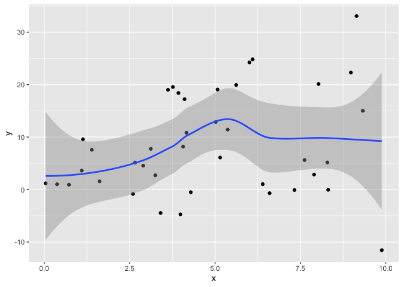
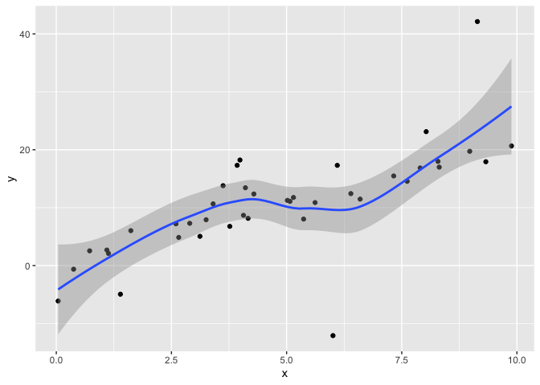
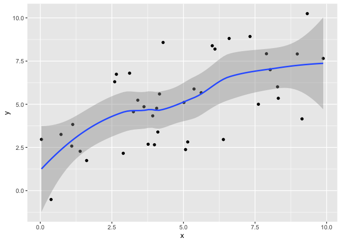
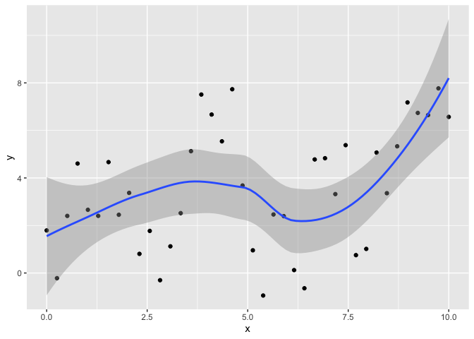

HW 7
================

This homework focuses on checking model assumptions. ROS states 6
assumptions for regression models

1.  Validity
2.  Representativeness
3.  Additivity and linearity
4.  Independence of errors
5.  Equal variance of errors
6.  Normality of errors

Assumptions 1 and 2 are very important, but focus more on how the data
were collected and the relationship between research question and data.
For this homework, we’ll focus on assumptions 3 - 6.

#### 1. (4 points)

In your own words, summarize the assumptions 3, 4, 5, and 6.

### Part 2

For each of the following questions, the dataset generated below
violates one of the assumptions. Respond to the following
questions/prompts

1.  Which assumption is violated? Why?
2.  Write out the true statistical model.
3.  Create a figure that shows the violation. Note: for full credit you
    may need to use `annotate()` to add text to your figure clearly
    pointing out the violation.
4.  Fit the model using `lm(y ~ x, data = )` or
    `stan_glm(y ~ x, data = )` how problematic is the violation of the
    assumption?

#### 2. (4 points)

``` r
set.seed(10102022)
n <- 40
x <- runif(n, 0, 10)
sigma <- 2
beta <- c(1,2)
y <- rnorm(n, beta[1] + beta[2] * x, x * sigma)

q2 <- tibble(x = x, y = y)
q2 %>% ggplot(aes(y=y, x=x)) + geom_point() + geom_smooth(method ='loess')
```

    ## `geom_smooth()` using formula 'y ~ x'

<!-- -->

#### 3. (4 points)

``` r
beta <- c(1,2)
y <- rt(n, df = 1) * sqrt(sigma) + beta[1] + beta[2] * x

q3<- tibble(x = x, y = y)
q3 %>% ggplot(aes(y=y, x=x)) + geom_point() + geom_smooth(method ='loess')
```

    ## `geom_smooth()` using formula 'y ~ x'

<!-- -->

#### 4. (4 points)

``` r
y <- rnorm(n, beta[1] + beta[2] * sqrt(x),  sigma)

q4 <- tibble(x = x, y = y)
q4 %>% ggplot(aes(y=y, x=x)) + geom_point() + geom_smooth(method ='loess')
```

    ## `geom_smooth()` using formula 'y ~ x'

<!-- -->

#### 5. (4 points)

``` r
x <- seq(0, 10, length.out = n)
y <- rep(0,n)

y[1] <- rnorm(1, beta[1] + beta[2] * x,  sigma)

for (i in 2:n){
  y[i] <- rnorm(1, beta[1] + beta[2] * x + .7 * y[i-1], sigma)
}
q5 <- tibble(x = x, y = y)
q5 %>% ggplot(aes(y=y, x=x)) + geom_point() + geom_smooth(method ='loess')
```

    ## `geom_smooth()` using formula 'y ~ x'

<!-- -->
